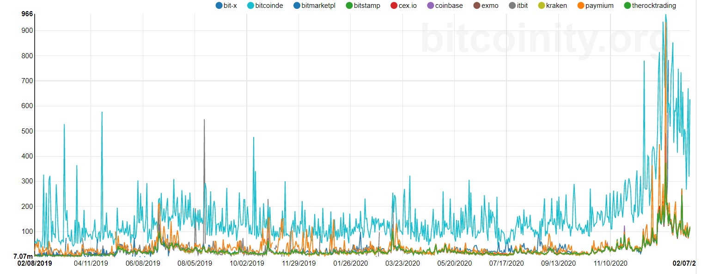
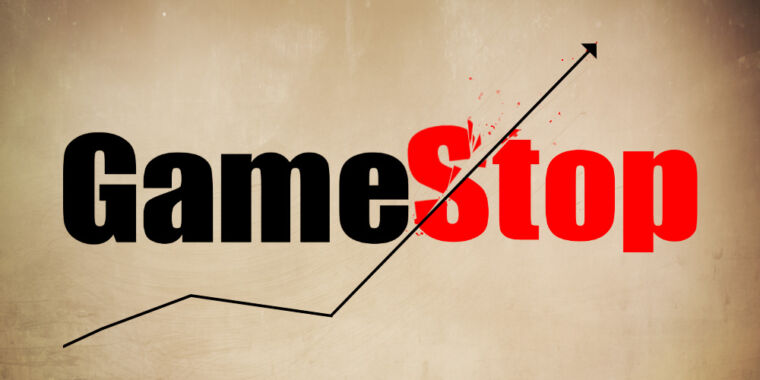
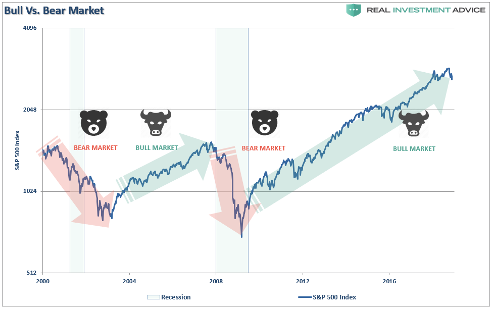
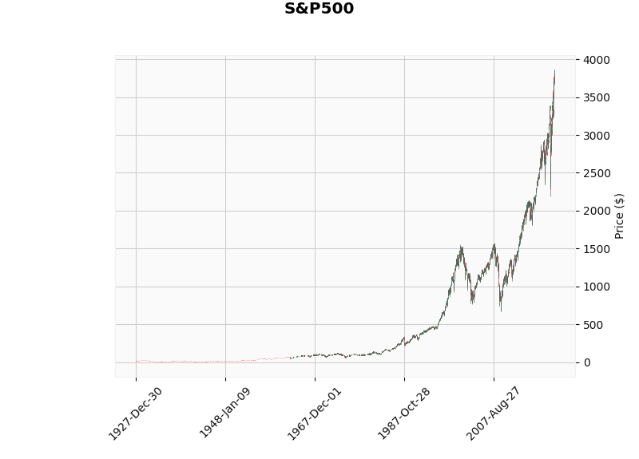
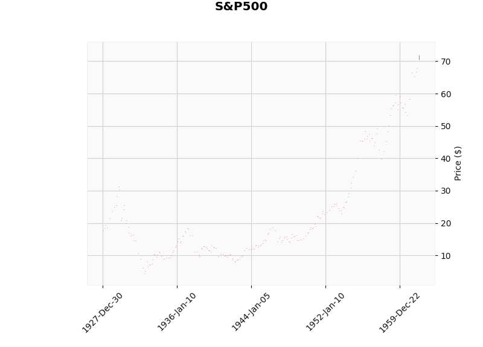

# Convention 

Folders and their meaning:

* Folder `analysis` contains your python or jupyter notebook where put analysis 
for a certain topic. Do not forget to put your name at the beginning.
* Folder `data` contains text data for training a model or for an analysis.
* Folder `images` contains images for a report.
* Folder `libs` contains framework that you would need more than once and you
would like to make it into a nice wrapper (e.g. a window scaler).
* Folder `papers` contains articles that you found useful and decided to save 
as access via a link is not possible.
* Folder `plots` contains your plots after analysis.
* Folder `scripts` contains ETL or certain movements for a data transformation.

Common rules:

* DO NOT PUSH your changes directly into MASTER branch: work in your local 
branch, then push your local branch, request a pull-request and after that 
let the gatekeeper (Ilia) know that you want to do a merge.
* Put your name(s) at the beginning of the python jupyter file(s).
* If you are not sure, ask. It is faster to prevent an issue than to solve it.

# Convolutional Networks for Stock Trading

We will try to use convolutional networks to predict movements in stock prices
from a picture of a time series of past price fluctuations, with the ultimate 
goal of using them to buy and sell shares of stock in order to make a profit.

## Useful resources 

* [Convolutional Networks for Stock Trading, Stanford](http://cs231n.stanford.edu/reports/2015/pdfs/ashwin_final_paper.pdf)
* [A quantitative trading method using deep convolution neural network](https://iopscience.iop.org/article/10.1088/1757-899X/490/4/042018/pdf)
* [Predicting the Trend of Stock Market Index Using the Hybrid Neural Network Based on Multiple Time Scale Feature Learning](papers/applsci-10-03961.pdf)
* [Algorithmic Financial Trading with Deep Convolutional Neural Networks: Time Series to Image Conversion Approach](https://www.researchgate.net/publication/324802031_Algorithmic_Financial_Trading_with_Deep_Convolutional_Neural_Networks_Time_Series_to_Image_Conversion_Approach)
* [Stock Market Buy/Sell/Hold prediction Using convolutional Neural Network](https://github.com/nayash/stock_cnn_blog_pub)
* [Kaggle: Predicting Stock Buy/Sell signal using CNN](https://www.kaggle.com/darkknight91/predicting-stock-buy-sell-signal-using-cnn/#data)
* [yahoo finance](https://finance.yahoo.com/quote/BTCUSD%3DX/history?p=BTCUSD%3DX)
* [Gentle Introduction to Models for Sequence Prediction with RNNs](https://machinelearningmastery.com/models-sequence-prediction-recurrent-neural-networks/)
* [Crypto Fear & Greed Index - Bitcoin Sentiment, Emotion Analysis](https://alternative.me/crypto/fear-and-greed-index/)

# Intro

We want to build a DNN that can predict the following trend by candle plot.

Every candle represents a certain time interval 1 day, 1 hour or 1 minute. Now 
let me briefly explain to you what does mean every bar that usually 
called a "candle".

Weeeell, we have red and blue or usually green candles on the picture. And upper
and lower tails shows us the highest and lowest prices respectively. Whereas, 
upper and downer sides of the bar show us opening price and closing not respectively.
If the bar is blue or green it means the opening price is lower than closing. 
If the bar is red vice versa.

# Our main goal

To have fun and finally to fill gaps from the last term in Deep Learning 
(LSTM, autoencoders). Also, to build a NN that allows to predict to following 
trend by the history right before it.

What's sequence of candle we should expect after 2PM?

# Tasks to reach our goal

GOAL: It is a well spread to suffer. Get used to it!

0. Read "Useful resources"  | NOT DONE
1. Collect Data: (Everybody) (yahoo.finance) | DONE
2. Conduct an initial analysis. | DONE
2. Train A CNN to extract data from a picture of a candle.
    1. Draw Candle plots for a fixed range (maybe a month) and save them as jpeg/png. | NOT DONE yet
    2. Slice those candle plots into a single candle plot. | NOT DONE yet
    3. Create labels out of those candle pictures. | DONE
    4. Create CNN regression model for a candle.
3. Apply Classic Approaches for Time series data:
    1. The autoregressive model AR(p). | DONE
    2. The moving average MA(q) Model. | DONE
    3. The ARMA(p,q) Model.
    4. Maybe show partial autocorrelation function.
4. Apply a NN:
    1. Apply a time delay neural networks TDNN.
    2. Apply a simple recurrent neural network RNN.
    3. Apply a LSTM.
5. Compare result.
    
# Financial & Trading Background 

As you have guessed so far the project is mainly focused on financial domain. We think it would be a good idea to provide you with some guidance into the complicated world of trading and finance in order to give a better overview and justification of some of our choices. 

## Volatility 

Simply speaking volatility is [*a measurement of price change*] (https://www.wallstreetmojo.com/volatility-formula/) of a certain asset or stock. Volatility is also associated with the risk of a certain asset.  

To put it into context: 

*  High volatility - suggests that the asset is subject to sharp price fluctuations. Consequently that would  mean that investing into such an asset will be associated with higher risks as there can be a negative spike in the price. On the other side such an asset is attractive to investors/traders as a positive spike may result in a large profit. 
* Low volatility - suggests that the asset is subject to very little or almost no price fluctuations. Investment into such assets is associated with lower risks. Usually low volatility is relevant for well-established or old markets.

At this point you probably would ask yourself whether CSPC and SP500 indexes are highly volatile? 

The answer is - mostly, or event better -  relatively no. 

Why this is important? Well, lowly volatile assets are usually part of a well-established market which is not subject to dramatic changes. This is good from data perspective, as the models are usually better predicting  such kind of data rather the one which is subject to constant strong fluctuations. So data-wise the choice was clear. 

In the light of recent events, you probably may ask yourself two questions:

* Why not BTC/ETH or any cryptocurrency?
* What would happen if the situation like with GameStop or Silver occurs? 

##### Why not crypto?

All cryptocurrencies are the part of developing market which is subject to constant dramatic changes (look at BTC & ETH price fluctuations). This would give us a hard time training our models. Additionally, from statistical point of view all cryptocurrencies are highly volatile.

While the plot above clearly represents BTC's high volatility. There is also another aspect which makes analyzing and predicting prices of crypto a bit hard - we do not know what exactly influences the prices. When we speak about company's stock (like Apple - AAPL or Goggle - GOOG stocks) you can rely on the company's revenues and financial reports/audits to make certain assumptions about the future price change and historical factors which influenced the change. The situation with crypto is not so obvious. There is a very sophisitcated analysis done to find the influencing factors (incl. buy and sell orders). A nice example of such an analysis - [Crypto Fear & Greed Index - Bitcoin Sentiment, Emotion Analysis](https://alternative.me/crypto/fear-and-greed-index/)

##### What if situation like with GameStock happens?

If the sitaution like that happens, probably our model and most exisitng models there won't be able to forsee that. Since such a behaviour is caused by factors which were not introduced before, the models won't be prepared for that. Probably considering the number of so called buy/sell orders could help to predict that but there is also the small delay between the number of buy orders increasing (as it was with GameStop) and price increasing as well. 

## Bear vs Bull 

Or also Bear vs Bullish market - what that actually means and why is that important? 

Simply bull market is an optimistic market which faces a positive trand in the assets's prices and bear market is the market facing a decrease in prices due to depressive enviroment or to the fact that the investors do not believe in the market. 

On the plot above you can see that one stock can face "bull" and "bear" periods. It is important to know whether the asset is a part of bullish or bear market in general (histoical view). The first one will let us know that despite all price fluctuations there is positive trend in price (and positive sharp spike called **bullrun** may occur). The opposite applies if an  asset is mostly a aprt of bear market. 

The data we are using is inclined towards a bullish market. 

# Initial Analysis 

Candles for the whole period.

There is something odd between 1948 and 1967.

Red dots are barely seen. Let's look at those as on a line.

Looks okay, but perhaps there was something wrong with data originally. So we 
will ignore these data until `1962-01-03`. So we have the next data for every
day (14 867 observations). 

