# Convention 

Folders and their meaning:

* Folder `analysis` contains your python or jupyter notebook where put analysis 
  for a certain topic. Do not forget to put your name at the beginning.
* Folder `data` contains text data for training a model or for an analysis.
* Folder `images` contains images for a report.
* Folder `libs` contains framework that you would need more than once and you
  would like to make it into a nice wrapper (e.g. a window scaler).
* Folder `papers` contains articles that you found useful and decided to save 
  as access via a link is not possible.
* Folder `plots` contains your plots after analysis.
* Folder `scripts` contains ETL or certain movements for a data transformation.

Common rules:

* DO NOT PUSH your changes directly into MASTER branch: work in your local 
  branch, then push your local branch, request a pull-request and after that 
  let the gatekeeper (Ilia) know that you want to do a merge.
* Put your name(s) at the beginning of the python jupyter file(s).
* If you are not sure, ask. It is faster to prevent an issue than to solve it.

# Convolutional Networks for Stock Trading

We will try to use convolutional networks to predict movements in stock prices
from a picture of a time series of past price fluctuations, with the ultimate 
goal of using them to buy and sell shares of stock in order to make a profit.

## Useful resources 

* [Convolutional Networks for Stock Trading, Stanford](http://cs231n.stanford.edu/reports/2015/pdfs/ashwin_final_paper.pdf)
* [A quantitative trading method using deep convolution neural network](https://iopscience.iop.org/article/10.1088/1757-899X/490/4/042018/pdf)
* [Predicting the Trend of Stock Market Index Using the Hybrid Neural Network Based on Multiple Time Scale Feature Learning](papers/applsci-10-03961.pdf)
* [Algorithmic Financial Trading with Deep Convolutional Neural Networks: Time Series to Image Conversion Approach](https://www.researchgate.net/publication/324802031_Algorithmic_Financial_Trading_with_Deep_Convolutional_Neural_Networks_Time_Series_to_Image_Conversion_Approach)
* [Stock Market Buy/Sell/Hold prediction Using convolutional Neural Network](https://github.com/nayash/stock_cnn_blog_pub)
* [Kaggle: Predicting Stock Buy/Sell signal using CNN](https://www.kaggle.com/darkknight91/predicting-stock-buy-sell-signal-using-cnn/#data)
* [yahoo finance](https://finance.yahoo.com/quote/BTCUSD%3DX/history?p=BTCUSD%3DX)
* [Gentle Introduction to Models for Sequence Prediction with RNNs](https://machinelearningmastery.com/models-sequence-prediction-recurrent-neural-networks/)
* [Crypto Fear & Greed Index - Bitcoin Sentiment, Emotion Analysis](https://alternative.me/crypto/fear-and-greed-index/)

## Brief overview of the resources 

##### Convolutional Networks for Stock Trading, Stanford

The place where everything started. While we had an idea on trying to visually predict the movement of stock prices, we decided to do a bit of research and this paper was among the first we had found. The paper gives an overview of applying the CNN on the graph of time series for past prices (as opposed to our research where we use candles instead) in order to make future price predictions.  The purpose of predicting the stock prices is simply to make profit. If the model predicts the movement correctly then that will result in profit for investor/trader making decisions based on that. The paper also mentions a very important aspect related to ML and AI in general - whether a presence of such tool in the market will have any dramatic impact on the market itself. All in all, the project resulted in some little success. The author suggests that for high frequencies of data it is better to use a classification approach as the price fluctuations within small periods are very minimal. 

##### A quantitative trading method using deep convolution neural network

The Deep convolution neural network has been a great success in field of image processing,but rarely applied in market portfolios. Theh paper oveviews the potential application of such networks into analyzing time series stock data and making predictions based on that. Some of suggestions from this paper were used to choose the models. 

# Introduction

Stock Market is very inpredictibale and throughout it's history there have been many attempts to try to predict it's movement.

There are many useful computational intelligence techniques for financial trading systems, including traditional Time Series analysis as well as newer more advanced methods such as Neural Networks. In our research we will look into both: the classic Time Series analysis, such as Moving Average, Autoregressive and ARMA models, as well as Neural Nets, such as Time Delay NN, RNN, LSTM and CNN.

CNN for trading or for predicting the stock market price movement, is a very new and recent approach that is still being researched and developed. So our attempt to try to build the CNN for trading predictions is purely for research and educational purposes.

For our reaseach we decided to use S&P500 index historical data.

Many traders predict the market movement by analizing so salled candle plots. We want to build a DNN that can predicts the following trend by candle plot image. 

**How does candle plot work?**

Every candle represents a certain time interval 1 day, 1 hour or 1 minute. Now  let us briefly explain to you what does mean every bar that usually is called a "candle" (because it resebles the candle).

We have red and blue or usually green candles as on the picture. Red color traditionaly represents a downward movement, e.i. if the openning price was higher that a close price.  Naturally green color (or blue) of the candle means that the price went up and that our close price is higher that the open price. And upper and lower tails shows us the highest and lowest prices respectively. Whereas,  upper and downer sides of the bar show us opening price and closing not respectively.

# Our main goal

To have fun and finally to fill gaps from the last term in Deep Learning  (LSTM, TDNN, RNN). Also, to build a NN that allows to predict to following  trend by the history right before it.

What's sequence of candle we should expect after 2PM?

We would like to biuld a tool for making a predictions from the candle plot, where user can select an area as shown below, and receive a prediction about the movement of the price of the S&P500 index.

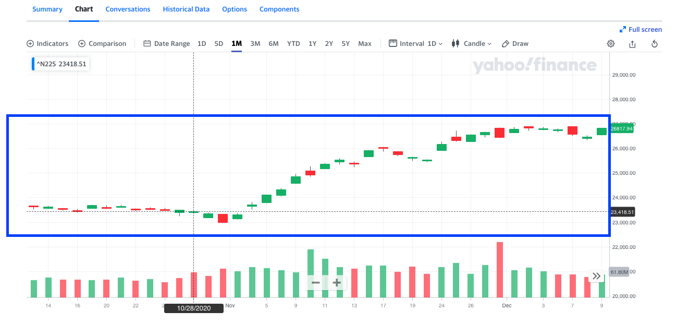

​    

# Financial & Trading Background 

As you have guessed so far the project is mainly focused on financial domain. We think it would be a good idea to provide you with some guidance into the complicated world of trading and finance in order to give a better overview and justification of some of our choices. 

## Volatility 

Simply speaking volatility is [*a measurement of price change*](https://www.wallstreetmojo.com/volatility-formula/) of a certain asset or stock. Volatility is also associated with the risk of a certain asset.  

To put it into context: 

*  High volatility - suggests that the asset is subject to sharp price fluctuations. Consequently that would  mean that investing into such an asset will be associated with higher risks as there can be a negative spike in the price. On the other side such an asset is attractive to investors/traders as a positive spike may result in a large profit. 
*  Low volatility - suggests that the asset is subject to very little or almost no price fluctuations. Investment into such assets is associated with lower risks. Usually low volatility is relevant for well-established or old markets.

At this point you probably would ask yourself whether CSPC and SP500 indexes are highly volatile? 

The answer is - mostly, or event better -  relatively no. 

Why this is important? Well, lowly volatile assets are usually part of a well-established market which is not subject to dramatic changes. This is good from data perspective, as the models are usually better predicting  such kind of data rather the one which is subject to constant strong fluctuations. So data-wise the choice was clear. 

In the light of recent events, you probably may ask yourself two questions:

* Why not BTC/ETH or any cryptocurrency?
* What would happen if the situation like with GameStop or Silver occurs? 

##### Why not crypto?

All cryptocurrencies are the part of developing market which is subject to constant dramatic changes (look at BTC & ETH price fluctuations). This would give us a hard time training our models. Additionally, from statistical point of view all cryptocurrencies are highly volatile.

While the plot above clearly represents BTC's high volatility. There is also another aspect which makes analyzing and predicting prices of crypto a bit hard - we do not know what exactly influences the prices. When we speak about company's stock (like Apple - AAPL or Goggle - GOOG stocks) you can rely on the company's revenues and financial reports/audits to make certain assumptions about the future price change and historical factors which influenced the change. The situation with crypto is not so obvious. There is a very sophisitcated analysis done to find the influencing factors (incl. buy and sell orders). A nice example of such an analysis - [Crypto Fear & Greed Index - Bitcoin Sentiment, Emotion Analysis](https://alternative.me/crypto/fear-and-greed-index/)

##### What if situation like with GameStop happens?

If the sitaution like that happens, probably our model and most exisitng models there won't be able to forsee that. Since such a behaviour is caused by factors which were not introduced before, the models won't be prepared for that. Probably considering the number of so called buy/sell orders could help to predict that but there is also the small delay between the number of buy orders increasing (as it was with GameStop) and price increasing as well. 

## Bear vs Bull 

Or also Bear vs Bullish market - what that actually means and why is that important? 

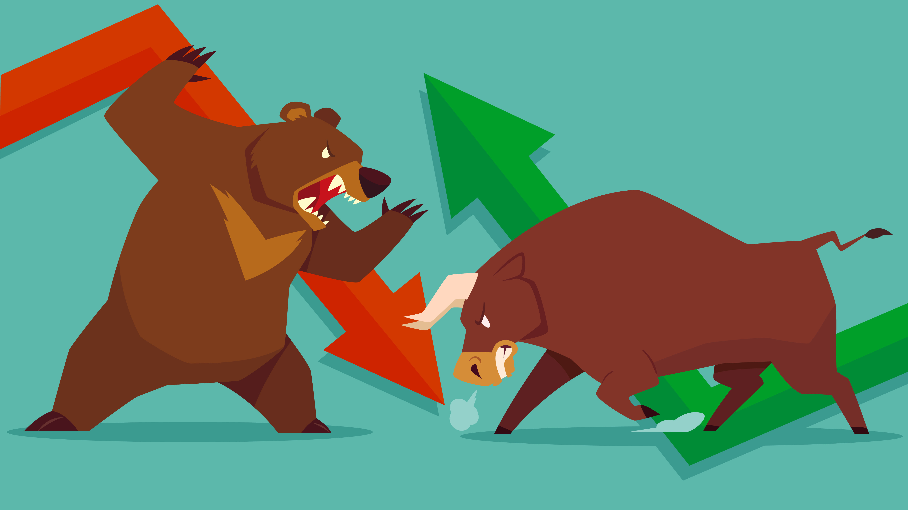

Simply bull market is an optimistic market which faces a positive trand in the assets' prices and bear market is the market facing a decrease in prices due to depressive enviroment or to the fact that the investors do not believe in the market. 

On the plot above you can see that one stock can face "bull" and "bear" periods. It is important to know whether the asset is a part of bullish or bear market in general (histoical view). The first one will let us know that despite all price fluctuations there is positive trend in price (and positive sharp spike called **bullrun** may occur). The opposite applies if an  asset is mostly a part of bear market. 

# Tasks to reach our goal

GOAL: It is a well spread to suffer. Get used to it!

0. Read "Useful resources"  | DONE
1. Collect Data: (Everybody) (yahoo.finance) | DONE
2. Conduct an initial analysis. | DONE
3. Train A CNN to extract data from a picture of a candle.
   1. Draw Candle plots for a fixed range (maybe a month) and save them as jpeg/png. | DONE 
   2. Slice those candle plots into a single candle plot. | DONE 
   3. Create labels out of those candle pictures. | DONE
   4. Create CNN regression model for a candle. | DONE
4. Apply Classic Approaches for Time series data:
   1. The autoregressive model AR(p). | DONE
   2. The moving average MA(q) Model. | DONE
   3. The ARMA(p,q) Model. | DONE
   4. Maybe show partial autocorrelation function. | DONE
5. Apply a NN:
   1. Apply a time delay neural networks TDNN. | DONE
   2. Apply a simple recurrent neural network RNN. | DONE
   3. Apply a LSTM. | DONE
   4. Apply a CNN | DONE
6. Compare results.

# Data 

We have used  S&P500 index historical data for our research. We have collected the raw data from https://finance.yahoo.com/.  This is what S&P500 index looks like on the website.

**Why S&P 500?**

S&P500 is a stock market index that measures the stock performance of 500 large companies listed on stock exchanges in the United States. For example, the 10 largest companies in the index, in order of weighting, are Apple Inc., Microsoft, Amazon.com, Facebook, Tesla, Inc., Alphabet Inc., Berkshire Hathaway, Johnson & Johnson, and JPMorgan Chase & Co., respectively.

It is one of the most commonly followed equity indices. The reason why is it so popular is because it reflects the overall state of the economy really well. 

It is also well established trading index with relatively non-volitile performance. The average annual total return and compound annual growth rate of the index, including dividends, since inception in 1926 has been approximately 9.8%, or 6% after inflation; however, there were several years where the index declined over 30%. The index has posted annual increases 70% of the time. However, the index has only made new highs on 5% of trading days, meaning that on 95% of trading days, the index has closed below its all-time high.

Initially we intended to use Bitcoin data for our research. But for reasons above, we have decided to focus our research on S&P500 index instead of Bitcoin, which is relatively new actor on the market with very high volaitlity.

# Data Description

Data preparation has been a significant part of our project as we deal with images of the financial time series data - it required a lot of preprocessing for various tasks. The complete pipeline is described below in this chapter.

The original data is located in the *"^GSPC*" csv file. Name "^GSPC" is the listed symbol of the S&P500 on the NYSE, Cboe BZX Exchange, NASDAQ exchanges. Data consists of 163,638 observations and 7 variables, including: Date, Open, High, Low, Close, Adjusted Close prices and volume. Here is the sample.

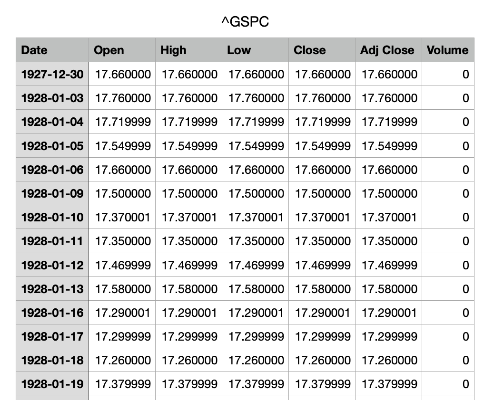

The time span of our data is from December 30, 1927 to January 22, 2021 - almost hundred years of data. 

**Sequences**

We have created a shortened version of the raw data - the *"SP500"* csv file. Since more reliable data is from aproximatelly 1962, we have discarted the data before January 2, 1962. 

Next, as part of the data preparation, we have create the sequences of these data. They were created by building a custom sequence distributor (see *sequence_distributor.py*) to slice data into the small windows of 30 days each, which will be used as predictors, and the slices with the span of 5 days - the target values that need to be predicted. The predictor and target data were scaled separetelly using different approaches. For  example, the 30-day predictor sequences were scaled by taking the minimum and maximus values: 4.5% and 95.5% respectively. So overall we have created 14,832 sequences. These sequences were used as an inputs for our Time Series Neural Networks: TDNN, LSTM, RNN.

**Pipeline** 

For analyzing the raw visual data,  we had to create a certain pipeline to put it into the proper format and then make forecasts based on that. First of all, simply inputting the whole sequence of candle plots and asking the models to make a forecast - (continue the picture) is not the best approach for our specific task. We need to detach the individual candles in the first place, remove the background noise (for instance the grid) and so on. The illustration below demonstrates how we do it. 

1. We take the  images with candle plots and then pass them trough our **selector**. The purpose of the **selector** is to find and detach each individual candle into separate images. 
2. As an output we get separated candles. 
3. Afterwards, we pass each individual candle trough **interpreter**. The purpose of interpreter is to convert  individual candles into more convenient numeric representation which we have already mentioned. 
4.  Afterwards we get the **HLOC** (High, Low, Open, and Close) values of our candles. The variable **__t__** represents the sequence of the candle. In other words the order. The index **__k__** - is the total number of candles at the input. It is very important to keep the sequence of the candles although we separate them as each next candle is dependent on previous one. 
5. As we get our data converted into convenient **HLOC** format we start the forecasting process using our ANN models by inputting those sequences into them. As an output we get the **HLOC** and **tk+1** values of the predicted candles. These predicted and input values together can be used by our candle plot generator to obtain the whole candle plot with forecasted candles. 

**Candles.**

Other part of our data preparation process we have created an images of the candles (see *candle_builder.py*). This was a tedious process, where we had to create candle plots and "cut-out" each candle separately. We did so by drawing the 30-day slices of the data, then slicing each of them into individual plots. These individual plots contain a sindle candle with preserved spatial properties (including the center). The size of each candle box is 34 (width) x 200 (hight) pixels. 

For model robustness, we have introduced a parameter *lambda λ* that controls the transparency of the candle color. In addition, we have added some background noise. Here are the samples of these candles.

                            

The names of the images of the individual candles are not random. They folow a pre-defined convention where first number of the image name means it belongs to the according sequence file, and the second number means the corresponding row number of that particular sequence. For example, if we are looking at the candle with name "7_1.png", it means that it belongs to the 7th sequence, 1st row in that 7th sequence.

These images of the candles were used as an input for CNN. More on the CNN methods later in the report.

**Selector.**

Our initial idea was to create a *selector* that would do a sophisticated slicing of the candle plots, however due to time constrains it is not ready. So the way it would work - it would take a part of the image with size 1150 x 210 pixels, and similarly to the *candle_builder*, would cut-off the slices of the image with candles with step size of 3 pixels in between the cuts. 

it would also calculate the gradient on x-axis that corresponds to and shows some edges of the candle. It would determine the center of the image and would add 17 pixels on each side of the of the slice. It would result in some brighter clusters and combine them together.

Then our selector would pass on this new data (individual images of the candles) to the interpretator.

# CNN Regressor 

**Train Interpretator.**

We have created a so called train "interpretator" (see *"train_interpretator.py"*) that trains CNN regressor model and outputs a price predictions for our **HLOC** values (High, Low, Open, Close). The architecture of this CNN model was inspired by AlexNet. Below is the performance result of our model, which gives quite good predictions.

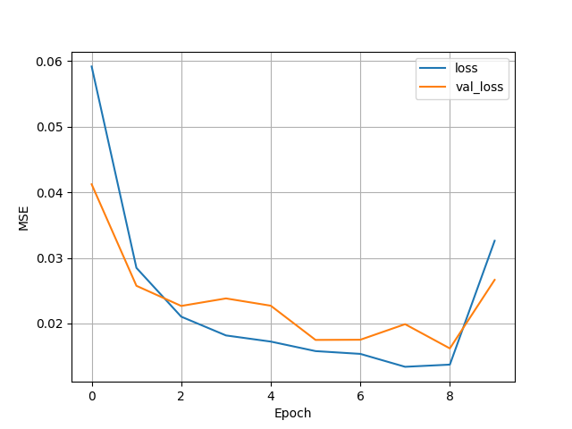

*"check_iterpretator.py"* - checks how our interpretator works. 

# Initial Analysis 

Candles for the whole period.

There is something odd between 1948 and 1967.

Red dots are barely seen. Let's look at those as on a line.

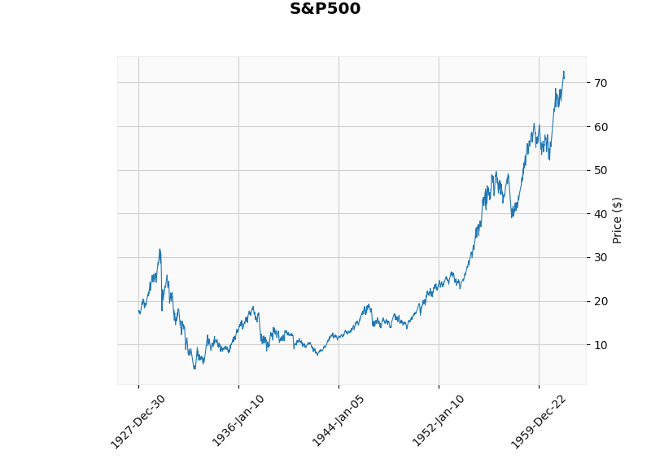

Looks okay, but perhaps there was something wrong with data originally. So we 
will ignore these data until `1962-01-03`. So we have the next data for every
day (14 867 observations). 

# Classic Approaches to Time Series data 

We explore three main Time Series Analysis methods:

1. Moving Average model MA(q).
2. Autoregressive model AR(p).
3. The  Autoregressive and Moving Average model ARMA(p,q).

**Moving Average model MA(q)**

We start with one of the oldest and simplest time series approaches is the moving average of the stock price to proxy the recent trend of the price. Let us looks at the historical Adjusted Close Price of our S&P500 index for the entire period.

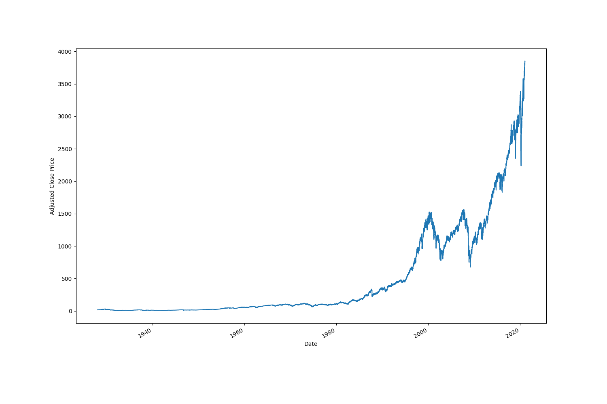

Now we apply MA(q) approach. The idea of the Moving Average mathod is that we use a q-day moving average of our price of our index, then a significant portion of the daily price noise will have been "averaged-out", so we smooth out short-term fluctuations. Thus, we can can observe more closely the longer-term behaviour of the asset, without the noise.

We compute a short moving average of one 1 year (MA253 - days) - the number of trading days in a year, and a long moving average of 5 years (MA1265 - days) of the Adj. Close Price.

We can see that the Adjusted Close Price has been nicely smoothed out. 

Now let us explore the more recent data. We now look at the the last 10 years of the data and our short term MA is 44 days (2 month - 22 trading days on average in a month) and long term MA is 1 year MA(253).

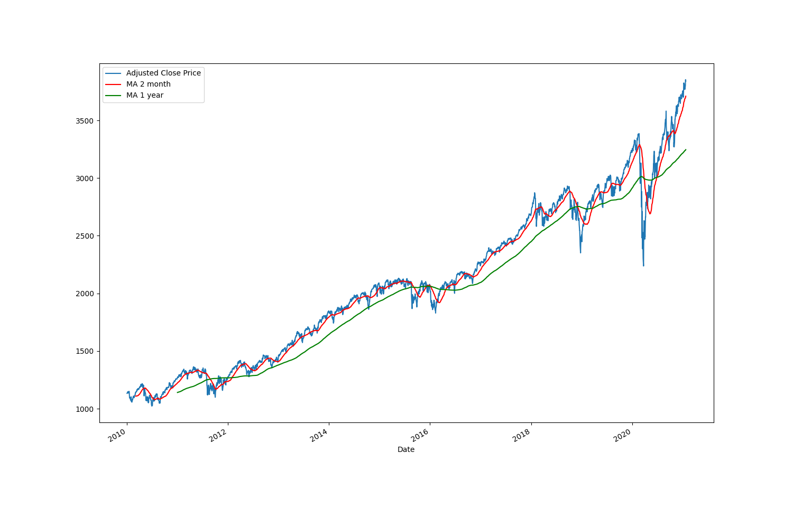

The general trend is very clear.

**Autoregressive model AR(p)**

In an Autoregressive model, we forecast the Adjusted Close price using a linear combination of past values of the variable. The term autoregression indicates that it is a regression of the variable against itself - AR(p) model, an autoregressive model of order p.

We first check our data for autocorrelation.

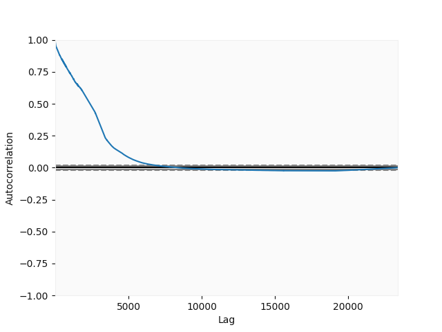

We can observe a strong positive autocorrelation for the first 5000 lags.

Now let us explore Autocorrelation Function ACF (left), and Partial Autocorrelation Function PACF (right).

If the time series is stationary, the ACF / PACF plots will show a quick drop-off in correlation after a small amount of lag between points. Our data is non-stationary as a high number of previous observations are correlated with future values.

Next, we fit AR model and compare the fitted train values and the test predictions for the last 5 years.

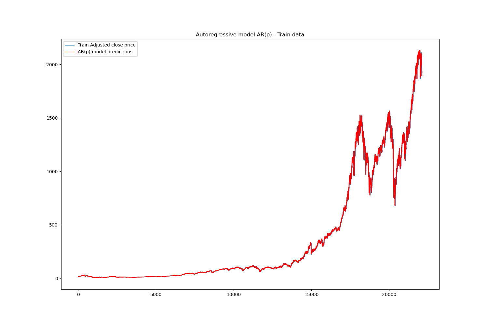

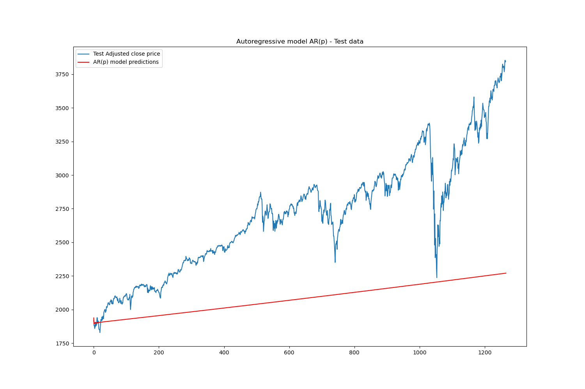

Train and test prediction results show that model is highly overfitted - it can't generalise well and performs poorly on unseen test data - resulting in linear fit.

**Auto Regression and Moving Average model ARMA(p,q)**

ARMA models combine autoregressive and moving average models and used to forecast a time series. The notation ARMA(p, q) refers to the model with p autoregressive terms and q moving-average terms.

The method is suitable for univariate time series without trend and seasonal components, this is why we first try to make our time series stationary. This is what our data and residuals look like after Log scale transformation.

We can also do a seasonal decomposition to detect seasonality in out data.

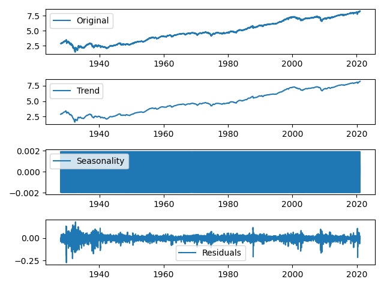

There is strange trend in seasonality - it might be because of non-stationarity of the data plus a very long time span.

Next, we apply the ARMA(2,0) model to the log transfomed Adjusted Close Price (AR order 2, MA order 0). We compare fitted values of the train data (left) and test predictions for the last 5 years (right).

Let us also fit ARMA(4,2) model (AR order 2, MA order 0) to the log residuals and see if this has any different effect. The train fitted residuals are on the left and test residual predictions (last 5 years) are on the right.

Again, as with AR model, ARMA model is highly overfitted and gives very poor predictions.

**Conclusion**

Classic Statistical approaches to Time Series data are really good to analize the structure of the data. But they generally  give poor prediction results, especially the case of non-stationary data. Even after we try to induce the stationarity to the data - the models still don't perform well. One of the possible applications of these methods are for short time windows. Classic statistical methods might be more suitable for short term spans.

# CNN models 

# Neural Networks for Time Series: TDNN, RNN, LSTM 

# Conclusion 

This was very interesting and complex project - we looked at the task from the various angels and applied many different models. Hovewer the project ended up being of a larger scale than we originally presumed. But this is exactly what have made this project even more interesting and we intent to continue working on it after the end of the Lerning from Images Course.

The idea of this project is to build a Convolutional Neural Network that would predict the S&P500 index market movement and price. In addition to this, we have disided to compare other Time Series approaches, including classic Time Series models as well as more contemporary and recent methods such as Time Delay Neural Net, Reccurent NN, and Long Short-Term Memory NN.

The traditional Time Series approaches, such as Moving Average, Autoregressive and ARMA methods, resulted in low performance with poor predictions.

Time Series Neural Networks proved to be a lot more effective and much better in making predictions. RNN and LSTM had almost similar performances. To our big surprise - our TDNN model had the best performance and bit other Neural Nets, giving the lowest Mean Absolute Error.

Our CNN model had the lowest performance among the Neural Net models, however it had still bit our expectations as we were not sure if this type of model would be able to make predictions on the stock market data. And to our pleasant surprise CNN model was able to make some accurate predictions even though not as accurate as Time Series Neural Nets.

